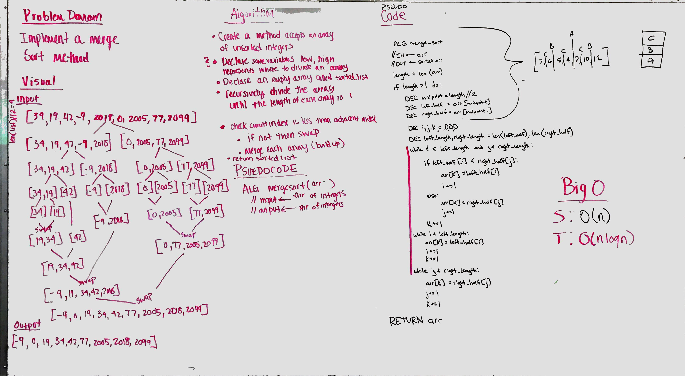

# Merge Sort

## Learning Objectives
What is Merge Sort?
How to implement merge sort

## Lecture Flow

***Main Points***
Like QuickSort, Merge Sort is a Divide and Conquer algorithm. It divides input array in two halves, calls itself for the
 two halves and then merges the two sorted halves. The merge() function is used for merging two halves. The merge(arr, l, m, r)
  is key process that assumes that arr[l..m] and arr[m+1..r] are sorted and merges the two sorted sub-arrays into one. 
  See following C implementation for details.

# Challenge Summary
Merge Sort is a Divide and Conquer algorithm. It divides input array in two halves, calls itself for the
two halves and then merges the two sorted halves.
 
## Challenge Description
Create a method that accepts an array and performs merge sort on the array. 

## Approach & Efficiency
Using in place method starting at index 1 and loop through to compare each index and swap the adjacent value if it is
 smaller than the current value. 

Time | Space
--- | ---
O(nlgn)) | O(n)

## Solution
[Code](../src/main/java/mergeSort/MergeSort.java) | [Tests](../src/test/java/mergeSort/MergeSortTest.java)

## Resources

### Videos
https://www.youtube.com/watch?v=JSceec-wEyw

### Reading
https://www.geeksforgeeks.org/merge-sort/

## Checklist
- [x] Top-level README “Table of Contents” is updated
- [x] Feature tasks for this challenge are completed
- [x] Unit tests written and passing
    - [x] “Happy Path” - Expected outcome
    - [x] Expected failure
    - [x] Edge Case (if applicable/obvious)
- [x] README for this challenge is complete
    - [x] Summary, Description, Approach & Efficiency, Solution
    - [x] Link to code
    - [x] Picture of whiteboard
