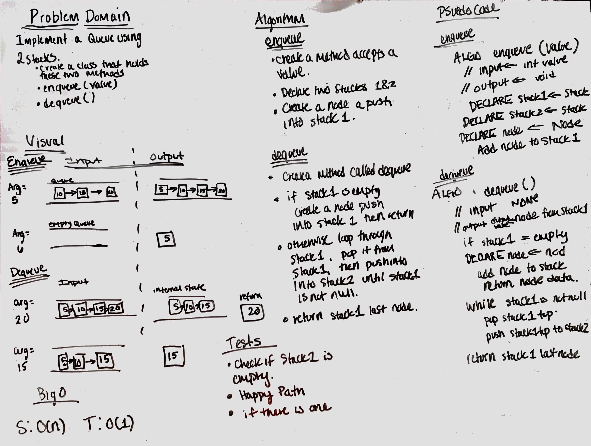

# Queue With Stacks

## Challenge
Implement a PsuedoQueue class that instantiates two stack objects and adds and removes as a queue.

## Approach & Efficiency

Create two methods `enqueue()` and `dequeue()`.

***`enqueue()`***

- `enqueue(value)` which inserts value into the PseudoQueue, using a first-in, first-out approach.

***`dequeue()`***

- `dequeue()` which extracts a value from the PseudoQueue, using a first-in, first-out approach.

Using two stacks for enqueue method, create a node and push into stack 1. Then for stack 2, check to see if stack 1 
is not null, if there is one then pop it from stack1. If there is more than one node from stack1, loop through and 
add all nodes to stack2.

Time | Space
--- | ---
O(n) | O(1)

## Solution
[Code](../src/main/java/queueWithStacks/QueueWithStacks.java) | [Tests](../src/test/java/queueWithStacks/QueueWithStacksTest.java)
